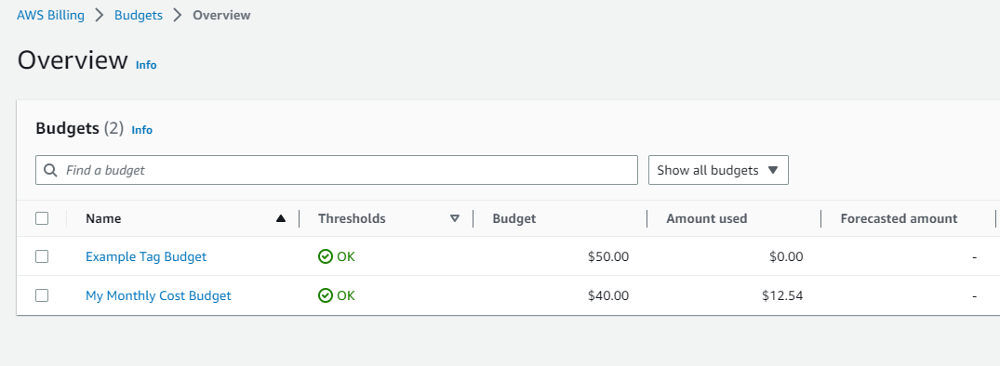
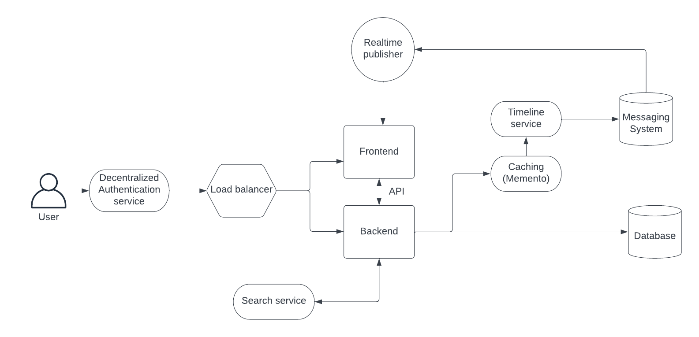
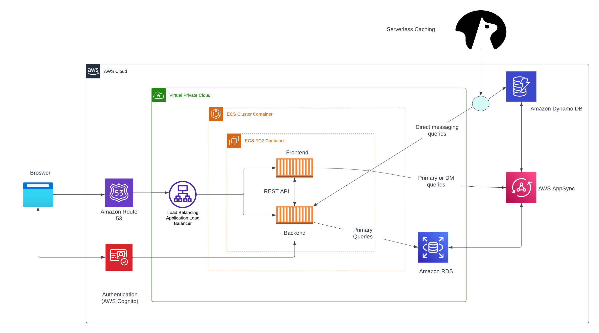

# Week 0 — Billing and Architecture

## Required Homework

## Alarm and budget

I redacted the account and email details from the json files.

Below is proof of work

## Conceptual diagram

[Link to Lucid diagram](https://lucid.app/lucidchart/644dedf2-015d-449f-87fb-67937eb2d23b/edit?viewport_loc=-43%2C-184%2C2219%2C979%2C0_0&invitationId=inv_e1db9ca8-bd90-47bd-8fa1-c3ab0cfd718a)

### Logical diagram

[Link to Lucid diagram](https://lucid.app/lucidchart/206df843-6faf-4a4a-b8e2-07ccd00e0ad8/edit?viewport_loc=-637%2C-151%2C2994%2C1423%2C0_0&invitationId=inv_abd62102-5014-4eaa-9950-9ada995b7336)
